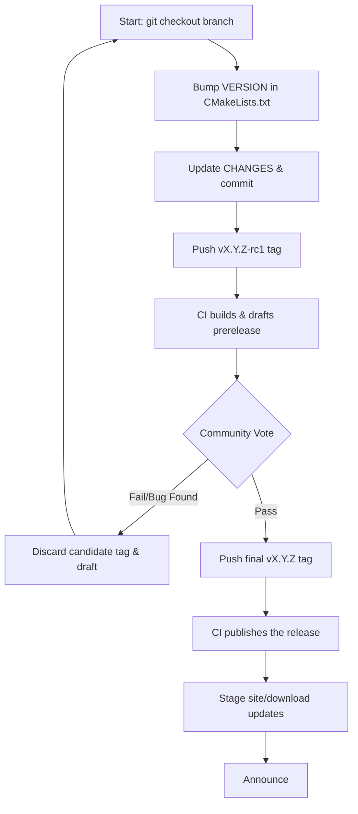

# Release Process for mod_http3

This document outlines the release engineering guidelines, verification steps, and release candidate workflow for `mod_http3`.

Only members of the Project Management Committee (PMC) and active Committers can serve as Release Managers (RM) or cast binding votes on releases. However, testing and feedback from all developers is highly encouraged.

---

## 1. Release Classifications and Versioning

We adopt the Apache HTTP Server's minor versioning strategy:
- **Odd-numbered minor versions** (e.g., `1.1.x`) are used for active development, alpha, and beta releases.
  - **Alpha**: Early development releases. May contain unfinished features or minor API instability.
  - **Beta**: Feature-complete development releases undergoing integration testing and stabilization.
- **Even-numbered minor versions** (e.g., `1.2.x`) are designated for **General Availability (GA)** stable releases. GA releases replace all previous releases, and their public interfaces remain stable throughout their minor version lifecycle.

---

## 2. Voting on Releases

For a release candidate to be officially published:
- At least **three (3) active PMC members** must vote affirmatively (`+1`).
- There must be **more positive (`+1`) than negative (`-1`) votes**.
- Unlike standard technical commits, there is no "veto" on release votes. If an issue is found, a new release candidate must be prepared.
- Source code archives (tarballs) are the only authoritative release artifacts. Binaries may be provided for convenience but must be generated from the exact source code of the approved release.

---

## 3. Release Workflow

Pushing a `v*` tag runs the [CI pipeline](../.github/workflows/ci.yml) against the tagged tree. Only once build, test, interop and pages have all passed does the [release stage](../.github/workflows/release.yml) run, and all it does is publish what those stages already produced: it retags the images, deploys the site, and uploads the build artifacts to a GitHub release named after the tag. An `-rcN` tag is published as a draft prerelease; a bare `vX.Y.Z` tag as a normal release.



### Step-by-Step Process

1. **Prepare Candidate**:
   Bump the `VERSION` field in `project(mod_http3 VERSION X.Y.Z)` at the top of [CMakeLists.txt](../CMakeLists.txt), update `CHANGES`, and commit. Artifact names come from that CMake version, and the workflow refuses to build if it disagrees with the tag.

2. **Tag and Push the Candidate**:
   ```sh
   git tag -a vX.Y.Z-rc1 -m "mod_http3 X.Y.Z-rc1"
   ./scripts/release.sh
   git push origin vX.Y.Z-rc1
   ```
   Candidate tags carry an `-rcN` suffix, so they are tagged by hand; `scripts/release.sh` builds the artifacts locally so you can inspect them. It also creates the bare `vX.Y.Z` tag from `CMakeLists.txt` — leave it, push only the `-rcN` tag, and step 5 will offer to move it onto the approved commit. Pushing the tag is what starts the workflow, and the workflow is the only thing that publishes a release — it re-checks the tag against `CMakeLists.txt`.

   The release carries these assets, each with a `.sha256` beside it:
   - `mod_http3-X.Y.Z.tar.gz` / `mod_http3-X.Y.Z.zip` — source snapshots (the authoritative release artifacts)
   - `mod_http3-X.Y.Z-linux-<arch>.tar.gz` / `mod_http3-X.Y.Z-linux-<arch>.zip` — generic Linux binaries
   - `mod_http3-X.Y.Z.<arch>.rpm` — RHEL/Fedora layout
   - `mod_http3_X.Y.Z_<arch>.deb` — Debian/Ubuntu layout

3. **Call the Vote**:
   Draft the vote email by hand, referencing the tag, the release URL, and the checksums. Send the vote proposal to the developer list to open the 72-hour vote.

4. **Handling Failures**:
   If the community finds a bug or votes down the candidate, remove the GitHub draft release and the local/remote tags:
   ```sh
   gh release delete vX.Y.Z-rc1 --yes
   git push origin --delete vX.Y.Z-rc1
   git tag -d vX.Y.Z-rc1
   ```
   Apply the fix, update your checkout, and restart from step 1 using the next candidate suffix (e.g., `rc2`).

5. **Publish Approved Release**:
   Once the vote passes, create and push the final tag. The workflow rebuilds from that tag and publishes the release:
   ```sh
   ./scripts/release.sh
   git push origin vX.Y.Z
   ```
   `scripts/release.sh` reads the version from `CMakeLists.txt` and creates the matching annotated `vX.Y.Z` tag after the artifacts build, so a failed build leaves no tag behind. If that tag already exists it asks before overwriting it, and refuses outright when there is no terminal to ask on.
   A tag can only be published once. To redo a release, delete it as in step 4 and push the tag again.

6. **Stage and Commit Site Updates**:
   Update website documentation, download pages, and CVE details, then commit them to publish.

7. **Announce**:
   Send announcement emails and move any relevant CVE issues to the public domain.

---

## 4. Verifying Releases

Every artifact ships with a `.sha256` file beside it. Download both and check:

```sh
gh release download vX.Y.Z --pattern 'mod_http3-X.Y.Z.tar.gz*'
sha256sum --check mod_http3-X.Y.Z.tar.gz.sha256
```

Provenance comes from the release itself: the assets are built by the [CI pipeline](../.github/workflows/ci.yml) from the tagged tree, and the run linked on the release page shows the exact commit and build log.

---

## 5. Committing Security Fixes

- Vulnerability fixes are staged in a private security repository first to allow testing.
- The commit of the fix should never obscure the security nature of the change.
- Commit messages must include the appropriate tracking details (such as CVE number) and the `CHANGES` entry should place the security fix at the top of the release list:
  ```
  *) SECURITY: CVE-YYYY-NNNN (cve.mitre.org)
     mod_http3: Fix potential connection stall when receiving malformed HTTP/3 frames.
  ```
